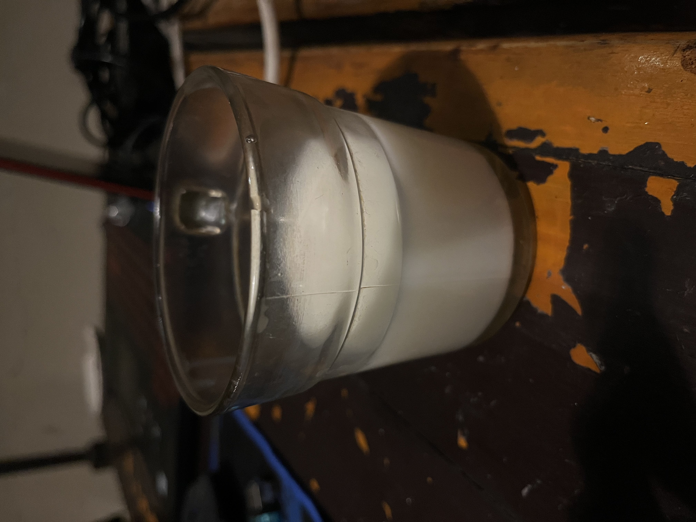

# **Laporan Praktikum**
# **Jobsheet 1 Pengantar PBO**

## **Data Mahasiswa**
><p>Nama: Muhammad Khairunnas Nurdin</p>
><p>Prodi: 2E</p>
><p>NIM:2241720133</p>
><p>Jurusan:Teknologi Informasi</p>
><p>Politeknik Negeri Malang</p>
<br>

## **1.Kompetensi**
Setelah menempuh materi percobaan ini, mahasiswa mampu mengenal:
1. Perbedaan paradigma berorientasi objek dengan paradigma struktural
2. Konsep dasar PBO

<br>

## **2.Percobaan 1**
Didalam percobaan ini, kita akan mendemonstrasikan bagaimana membuat class, membuat object, 
kemudian mengakses method didalam class tersebut.
1. Buka Netbeans, buat project SepedaDemo.
2. Buat class Sepeda. Klik kanan pada package sepedademo – New – Java Class.
3. package sepedaDemo terdapat 2 class, yaitu:

<br>

    A.class Sepeda:
```java
public class Sepeda {
    private String merek;
    private int kecepatan;
    private int gear;

    public void setMerek(String newValue) {
        merek = newValue;
    }
    public void gantiGear(int newValue) {
        gear = newValue;
    }
    public void tambahKecepatan(int increment) {
        kecepatan= kecepatan + increment;
    }
    public void rem(int decrement) {
        kecepatan = kecepatan - decrement;
    }

    public void cetakStatus() {
        System.out.println("Merek: " + merek);
        System.out.println("Kecepatan: " + kecepatan);
        System.out.println("Gear: " + gear);
    }

}
```
<br>

    B.class SepedaDemo:
```java
public class SepedaDemo {
    public static void main(String[] args) {
        // Buat dua buah objek sepeda
        Sepeda spd1 = new Sepeda();
        Sepeda spd2 = new Sepeda();

        // Panggil method didalam objek sepeda
        spd1.setMerek("Polygone");
        spd1.tambahKecepatan(10);
        spd1.gantiGear(2);
        spd1.cetakStatus();

        spd2.setMerek("Wim Cycle");
        spd2.tambahKecepatan(10);
        spd2.gantiGear(2);
        spd2.tambahKecepatan(10);
        spd2.gantiGear(3);
        spd2.cetakStatus();

    }
}
```
<br>

Hasil Run:


<br>

## **3.Percobaan 2**
Didalam percobaan ini, akan didemonstrasikan salah satu fitur yang paling penting dalam PBO, yaitu 
inheritance. Disini kita akan membuat class SepedaGunung yang mana adalah turunan/warisan dari
class Sepeda. Pada dasarnya class SepedaGunung adalah sama dengan class Sepeda, hanya saja pada
sepeda gunung terdapat tipe suspensi. Untuk itu kita tidak perlu membuat class Sepeda Gunung dari
nol, tapi kita wariskan saja class Sepeda ke class SepedaGunung.

Penjelasan lebih detail tentang inheritance akan dibahas pada modul selanjutnya.

1. Masih pada project SepedaDemo. Buat class SepedaGunung.
2. Tambahkan kode extends Sepeda pada deklarasi class SepedaGunung. Kode extends ini
menandakan bahwa class SepedaGunung mewarisi class Sepeda.
3. Berikut code class SepedaGunung dan setelah ditambahkan code pada SepedaDemo

<br>

     A.code SepedaGunung:
```java
public class SepedaGunung extends Sepeda {
    private String tipeSuspensi;

    public void setTipeSuspensi(String newValue) {
        tipeSuspensi = newValue;
    }

    public void cetakStatus() {
        super.cetakStatus();
        System.out.println("Tipe suspensi: " + tipeSuspensi);
    }
}
```
<br>

    B.code SepedaDemo:
```java
public class SepedaDemo {
    public static void main(String[] args) {
        // Buat dua buah objek sepeda
        Sepeda spd1 = new Sepeda();
        Sepeda spd2 = new Sepeda();
        SepedaGunung spd3 = new SepedaGunung();

        // Panggil method didalam objek sepeda
        spd1.setMerek("Polygone");
        spd1.tambahKecepatan(10);
        spd1.gantiGear(2);
        spd1.cetakStatus();

        spd2.setMerek("Wim Cycle");
        spd2.tambahKecepatan(10);
        spd2.gantiGear(2);
        spd2.tambahKecepatan(10);
        spd2.gantiGear(3);
        spd2.cetakStatus();

        spd3.setMerek("Klinee");
        spd3.tambahKecepatan(5);
        spd3.gantiGear(7);
        spd3.setTipeSuspensi("Gas suspension");
        spd3.cetakStatus();
    }
}
```
<br>

    Hasil Run:

<br>

## **4.Pertanyaan**
1. Jelaskan perbedaan antara objek dengan class!
   >**Jawab:**
   >perbedaan yang jelas adalah, class merupakan suatu blueprint atau prototype dari objek, dan objek itu sendiri adalah hasil instansiasi suatu class atau hasil dari suatu blueprint class. Biasanya untuk membikin objek dari suatu class pada Bahasa pemrograman java diawali -> “namaClass namaObjek = new namaClass();”

2. Jelaskan alasan warna dan tipe mesin dapat menjadi atribut dari objek mobil!
   >**Jawab:**
   >karena pada umumnya suatu mobil memiliki ciri-ciri atau state berupa warna pada exteriornya dan tipe mesin untuk menggerakan mobil, maka kita dapat menjadikan ciri-ciri atau state tersebut menjadi attribute pada objek mobil, juga attribute pada suatu objek merupakan ciri-ciri atau state dari suatu objek tersebut

3. Sebutkan salah satu kelebihan utama dari pemrograman berorientasi objek dibandingkan dengan pemrograman struktural!
   >**Jawab:**
   ><p>1.pada PBO kita dapat menghindari duplikasi kode, karena untuk suatu objek yang mirip dan cocok dengan blueprint atau class kita, maka tidak perlu membuat code untuk objek yang mirip berulangkali  (semisal sepeda gunung dan sepeda balap, kita hanya membuat class sepeda untuk blueprint dan tinggl mengisi attribute dan method sesui objek kita)</p>
   ><p>2.lebih fleksible untuk melakukan modifikasi maupun perubahan fitur, karna kita hanya perlu merubah sedikit bagian pada PBO dibandingkan Struktural Programming </p>
   ><p>3.lebih mudah untuk developing aplikasi dan pengaplikasian masalah di dunia nyata ke PBO, karena PBO di desain atau dimodelkan mirip dengan objek di dunia nyata, sehingga kita mudah untuk proses develop</p>
   
4. Apakah diperbolehkan melakukan pendefinisian dua buah atribut dalam satu baris kode seperti
“public String nama,alamat;”?
   >**Jawab:** 
   >diperbolehkan , karena pada Bahasa pemrograman java kita dapat mendeklarasikan suatu variable atau dalam kasus ini adalah attribute (sebutan variable di konsep PBO) secara multiple nama attribute dalam satu jenis tipe data

5. Pada class SepedaGunung, jelaskan alasan atribut merk, kecepatan, dan gear tidak lagi ditulis di
dalam class tersebut!
   >**Jawab:** 
   > karena class SepedaGunung menerapankan inheritance atau pewarisan, sehingga mewarisi class Sepeda. Dalam inheritance, attribute dan method pada class dapat diwariskan dan tidak perlu di tulis ulang pada child class nya.Dalam kasus class SepedaGunung, untuk attribute merk, kecepatan, dan gear sudah terdapat pada class parentnya yaitu Sepeda, sehingga tidak perlu di tulis lagi pada class SepedaGunung

<br>

## **6.Tugas Praktikum**
1. Lakukan langkah-langkah berikut supaya tugas praktikum yang dikerjakan tersistematis:
   <p>a. Foto 4 buah objek di sekitar kalian dengan 2 objek di antaranya merupakan objek yang
   mengandung konsep pewarisan (inheritance), contoh: kulkas, kursi, meja ruang tamu, meja
   belajar sehingga diketahui meja ruang tamu dan meja belajar mewarisi objek meja!</p>
   <p>b. Lakukan pengamatan terhadap 4 objek tersebut untuk menentukan atribut dan methodnya!</p>
   <p>c. Berdasarkan 4 buah objek tersebut, buat class nya dalam Bahasa pemrograman Java!</p>
   <p>d. Perlu diperhatikan bahwa terdapat dua class hasil pewarisan sehingga perlu menambah satu
   class baru sebagai class yang mewarisi dua class tersebut!</p>
   <p>e. Tambahkan dua atribut untuk setiap class!</p>
   <p>f. Tambahkan tiga method untuk setiap classtermasuk method cetak informasi!</p>
   <p>g. Tambahkan satu class Demo sebagai main!</p>
   <p>h. Instansiasikan satu buah objek untuk setiap class!</p>
   <p>i. Terapkan setiap method untuk setiap objek yang dibuat!</p>
   <p>j. Contoh yang telah disebutkan pada poin 1.a tidak diperbolehkan dipakai dalam pengerjaan
   tugas praktikum ini!</p>
   
<br>

**Jawab:**

<br>

   ><p>A.Image object cup:<br> </p>
<br>

   ><p>code Cup class:</p>
   ```java
   public class Cup {
    private String material, content;

    public void setMaterial(String material) {
        this.material = material;
    }

    public void setContent(String content) {
        this.content = content;
    }

    public void printInfo() {
        System.out.println("Chair Color\t: " + material + "\nCondition\t: " + content);
    }
}
   ```
<br>

   ><p>B.Image object Lighter:<br></p>
<br>

   ><p>code Lighter class:</p>
   ```java
   public class Lighter {
   private double size;
   private String condition;

   public void countSize(double length, double width) {
      this.size = length * width;
   }

   public void setCondition(String condition) {
      this.condition = condition;
   }

   public void printInfo() {
      System.out.println("Table Size: " + size + " Square Meter" +  "\nForm\t  : " + condition);
   }
}
   ```
<br>

   ><p>c.2 Image object Smartphone:<br>Iphone 13<br><br>Poco F5 GT<br></p>
<br>

   ><p>code Smartphone class (parent):</p>
   ```java
   public class Smartphone {
   private String brand, os;

   public void setBrand(String brand) {
      this.brand = brand;
   }

   public void setOs(String os) {
      this.os = os;
   }

   public void printInfo(String typeInfo, Object valueInfo) {
      System.out.println("Brand Smartphone\t: " + brand + "\nOperating System\t: " + os + "\n" + typeInfo + "\t: " + valueInfo);
   }
}
   ```
<br>

   ><p>code Iphone13 class (child from Smartphone):</p>
   ```java
   public class Iphone13 extends Smartphone {
   private int price;

   public void setPrice(int price) {
      this.price = price;
   }

   public int getPrice() {
      return price;
   }

   public void printInformation() {
      super.printInfo("price", price);
   }
}
   ```
<br>

><p>code PocoF5 class (child from Smartphone):</p>
   ```java
   public class PocoF5 extends Smartphone {
   private String type;

   public void setType(String type) {
      this.type = type;
   }

   public void printInformation() {
      super.printInfo("type Smartphone: ", type);
   }
}
   ```
<br>

><p>code Demo class (Main class)</p>
   ```java
   public class Demo {
   public static void main(String[] args) {
//        create Object from our 4 class
      Cup cupOne = new Cup();
      Lighter lighterOne = new Lighter();
      Iphone13 iphone13One = new Iphone13();
      PocoF5 pocoF5One = new PocoF5();

      System.out.println("call method from Cup Class");
      cupOne.setMaterial("glass");
      cupOne.setContent("milk");
      cupOne.printInfo();

      System.out.println("\ncall method from Lighter class");
      lighterOne.countSize(0.03f, 0.01f);
      lighterOne.setCondition("not broken");
      lighterOne.printInfo();

      System.out.println("\ncall method from Iphone13 class");
      iphone13One.setOs("IOS");
      iphone13One.setBrand("Iphone");
      iphone13One.setPrice(15000000);
      iphone13One.printInformation();

      System.out.println("\ncall method from PocoF5 class");
      pocoF5One.setOs("Android");
      pocoF5One.setBrand("Poco");
      pocoF5One.setType("F5 GT");
      pocoF5One.printInformation();
   }
}
   ```
<br>

Hasil run:

